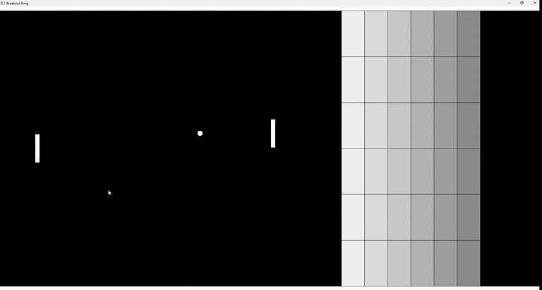

# Breakout-Pong



## Description

The classic Atari games Breakout and Pong combined. The goal is to bounce the ball off the opponent's side of the screen (right) while preventing it from bouncing off yours (left). There is a simple AI-controlled paddle and multiple breakable tiles opposing the player. The game is over when the ball hits either side of the screen.

Created by building upon the Pong tutorial in the book "Game Programming in C++: Creating 3D Games" by Sanjay Madhav. Utilizes the SDL2 library for rendering and input handling.

## Controls

- Up and down arrows or `W` and `S` to move the player's paddle
- `P` to pause the game

## Features

- Proper collision detection with walls, paddles and tiles
- Ball speed increases slightly with each tile hit
- AI paddle dodges the ball when bouncing off of tiles

## Possible improvements

- [ ] Remove magic numbers to ensure compatibility with different screen resolutions
- [x] Implement menus
- [ ] Implement a restart button
- [ ] Implement the possibility to aim the ball instead of using uniform bounce angles
- [ ] Improve AI with some logic instead of just bouncing up and down

Feel free to open up an issue or create a pull request to contribute. No need to worry about what's the "correct" way to do these things, I'm still learning too!

## Installation

### Non-developers

See the releases section or click [here](https://github.com/MJKagone/Breakout-Pong/releases/latest).

### Developers (instructions for Ubuntu)

Dependencies: `sudo apt install cmake && sudo apt install libsdl2-ttf-dev`

Then run the following:

```bash
git clone https://github.com/MJKagone/Breakout-Pong.git
cd Breakout-Pong
mkdir build
cd build
cmake ..
make
```


